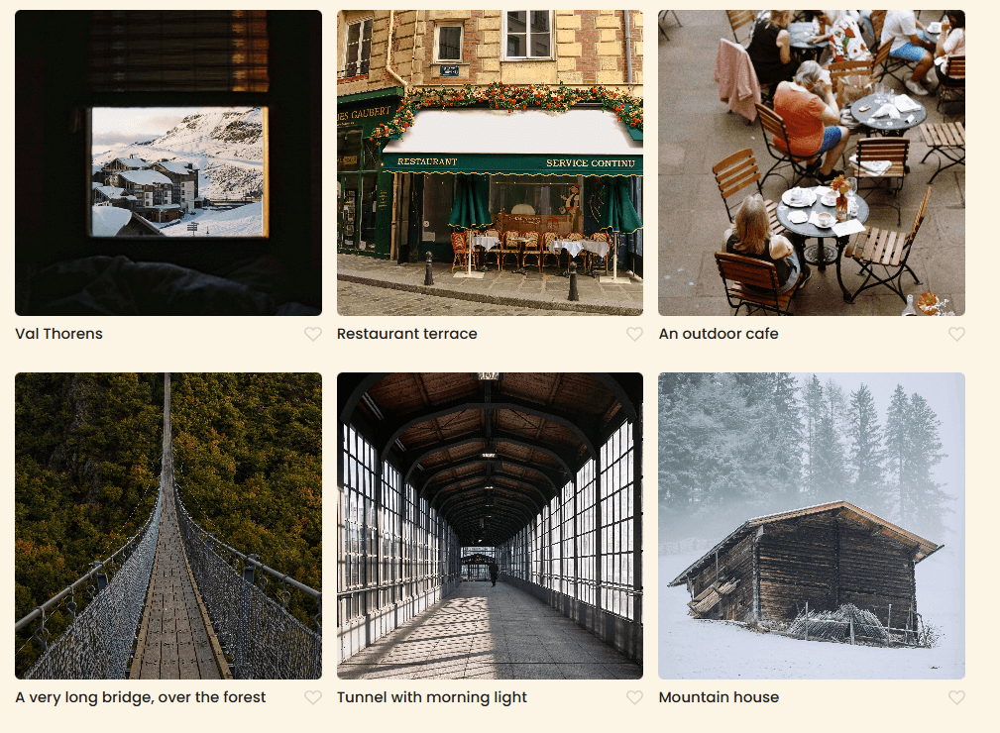

# Spots

Spots is a social media website that allows users to access and share images with people around the world.

## Description

Users can create their own profiles with bio's detailing who they are and what their interests are.

They will be able to upload pictures with captions, allowing them to express themselves creativly.

Everyone will also be able to like posts, allowing their feeds to be filled with content catered to them personally.

## Tech Stack

- Html
- Css
- Responsive Design

## Example Pictures:

## Deployment

This website is deployed to Github Pages

- Deplyment Link: https://voidsky02.github.io/se_project_spots/
